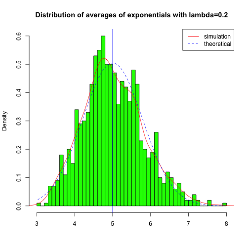
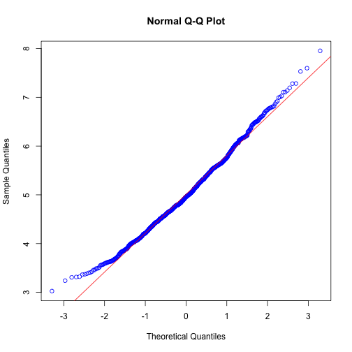
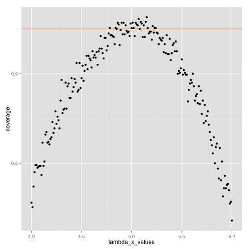

Statistical Inference: Peer Assessment 1
----------------------------------------

##  Simulation Exercises

###  Simulations
The exponential distribution can be simulated in R with rexp(n, lambda) where lambda ($\lambda$) is the rate parameter. The mean of exponential distribution is $1/\lambda$ and the standard deviation is also $1/\lambda$. Set $\lambda=0.2$ for all of the simulations. In this simulation, we investigate the distribution of averages of 40 exponential(0.2)s. 
### Visible settings

```r
echo = TRUE
options(scipen = 1)
```
### Initiate thousand or so simulated averages of 40 exponentials

### Set parameters

```r
lambda <- 0.2
exponentials_size <- 40
simulations_size <- 1000
```
### Perform thousand simulations

```r
simulate_exponentials <- matrix(rexp(simulations_size*exponentials_size, rate=lambda), simulations_size, 
                                exponentials_size)
```
### Calculate 40 exponentials average

```r
row_means <- rowMeans(simulate_exponentials)
```

### 1. Show where the distribution is centered at and compare it to the theoretical center of the distribution.

```r
### Calculate mean of distribution of averages for 40 exponentials
mean(row_means)
```

```
## [1] 5.014417
```

```r
### mean from lambda
1/lambda
```

```
## [1] 5
```
### Distribution of exponentials:

```r
### Plot the graph
hist(row_means, breaks=50, prob=TRUE,
     main="Distribution of averages of exponentials with lambda=0.2",
     xlab="", col="green")
### density of the averages of exponentials
lines(density(row_means), col="red")
### Theoretical center of the distribution
abline(v=1/lambda, col="blue")
### theoretical density of the averages of exponentials
xfit <- seq(min(row_means), max(row_means), length=100)
yfit <- dnorm(xfit, mean=1/lambda, sd=(1/lambda/sqrt(exponentials_size)))
lines(xfit, yfit, pch=22, col="blue", lty=2)
### add legend to the graph
legend('topright', c("simulation", "theoretical"), lty=c(1,2), col=c("red", "blue"))
```

 

Based on the above observations, the distribution of averages of 40 exponentials is centered at 5.0144167 and the same is close to the theoretical center of the distribution, which is $\lambda^{-1}$ = 5.    

### 2. Show how variable it is and compare it to the theoretical variance of the distribution.


```r
### standard deviation of the distribution of averages of 40 exponentials
sd(row_means)
```

```
## [1] 0.7891201
```

```r
### standard deviation from analytical expression
(1/lambda)/sqrt(exponentials_size)
```

```
## [1] 0.7905694
```

```r
### variance of the exponentials mean
var(row_means)
```

```
## [1] 0.6227106
```


```r
### Theoritcal variance of the distribution - 1/((lambda^2)* n)
1/((0.2*0.2) * 40)
```

```
## [1] 0.625
```

Based on the results, the variance in the distribution of averages of 40 exponentials is close to the theoretical variance of the distribution. The variance of exponentials means is 0.6227106  and theoretical variance of the distribution is $\sigma^2 / n = 1/(\lambda^2 n)$ = 0.625.  

### 3. Show that the distribution is approximately normal.


```r
### Plot qqplot and qqline to compare the distribution of averages of 40 exponentials to a normal distribution
qqnorm(row_means, col="blue")
qqline(row_means, col = 2)
```

 

Based on the above figure, q-q plot shows the distribution of averages of 40 exponentials is approximately close to a normal distribution.  

### 4. Evaluate the coverage of the confidence interval for $1/\lambda = \bar{X} \pm 1.96 \frac{S}{\sqrt{n}}$.


```r
# Evaluate coverage of the confidence interval
lambda_x_values <- seq(4, 6, by=0.01)
coverage <- sapply(lambda_x_values, function(lamb) {
    mu_hats <- rowMeans(matrix(rexp(exponentials_size*simulations_size, rate=0.2),
                               simulations_size, exponentials_size))
    ll <- mu_hats - qnorm(0.975) * sqrt(1/lambda**2/exponentials_size)
    ul <- mu_hats + qnorm(0.975) * sqrt(1/lambda**2/exponentials_size)
    mean(ll < lamb & ul > lamb)
})
# Plot Graph
library(ggplot2)
qplot(lambda_x_values, coverage) + geom_hline(yintercept=0.95, col=2)
```

 

Based on the above figure, selection of $\hat{\lambda}$ around 5, the average of the exponentials mean falls within the confidence interval at least 95% of the time. 

The confidence interval is given by 3.4677413, 6.5610922 

*** Important Note: *** Please see the below links for reports

rpubs -> http://rpubs.com/srikanthkamineni/Statistical-Inference

github -> https://github.com/srikanthkamineni/Statistical-Inference-Project1
